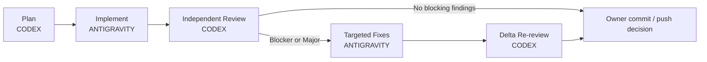

# Governed AI-Assisted Engineering Workflow

## High-Risk Payment Integration Case Study

> **Public portfolio edition.** This case study is sanitized from a private production workflow. Project names, repositories, paths, commits, provider identities, credentials, customer data, and proprietary document names are intentionally omitted.

This example shows how I use AI coding agents for a financial integration without turning every step into an expensive “deep review.” The workflow separates **planning, implementation, independent review, and evidence-driven remediation**, with explicit limits on context, specialists, test repetition, and re-review scope.

## What this demonstrates

- risk-based executor routing;
- progressive disclosure of specialist capabilities;
- payment-provider anti-corruption boundaries;
- durable idempotency and deduplication;
- crash-recovery and concurrency reasoning;
- one active writer per work surface;
- independent read-only review;
- targeted remediation from findings;
- delta re-review instead of restarting the audit;
- context and model-credit governance.

## Cost-aware execution

These prompts are designed not only around engineering risk, but also around the relative cost of the agents, models, and validation paths used at each stage.

Higher-capability or more expensive reasoning is reserved for architecture, security-sensitive decisions, concurrency, financial-state correctness, and independent review. More bounded implementation work is routed to execution-focused agents with narrower context and proportional validation.

The workflow therefore favors:
- the cheapest reliable executor for each stage;
- progressive disclosure of context and specialist capabilities;
- focused verification instead of repeated broad checks;
- reuse of fresh evidence when it is tied to the same unchanged worktree;
- full release-grade validation only when merge, release, deploy, or production readiness is actually in scope.

> **The objective is to maximize useful engineering evidence per unit of model context, time, and agent credit without weakening the checks required by the risk of the change.**

## Workflow



## Shared governance

These rules are assumed by every stage:

- Project architecture, approved specifications, contracts, tests, and actual repository state outrank agent preferences or skills.
- Verify named capabilities before depending on them; never install or revive one merely to satisfy a prompt.
- Keep one active writer per work surface.
- Use at most one primary specialist and one validator unless a new risk explicitly creates a separate checkpoint.
- Prefer exact diffs, symbols, ranges, and affected tests over broad reads.
- Do not restate large unchanged context in completion reports.
- Do not use a full ship/release gate before merge, release, deploy, or production-readiness scope.
- High-risk claims about financial state, persistence, crash recovery, or real concurrency still require direct evidence.
- Stop when the stage acceptance criteria are met. Do not pre-execute future phases.

---

# Prompt 1 — Payment Adapter Planning

**Executor:** `CODEX`  
**Goal:** freeze a provider-adapter design from current official documentation without coupling the canonical payment model to provider terminology.

```text
EXECUTOR: CODEX
TASK_ID: PAYMENTS-ADAPTER-PLAN-001
MODE: HIGH-RISK TECHNICAL PLANNING

SCOPE:
- official provider verification;
- PaymentPort mapping;
- ambiguity/reconciliation design;
- callback boundary;
- sandbox evidence plan.

OUT OF SCOPE:
application code, DB migrations, credentials, real transactions, production,
merge, final provider selection.

## Capability routing

The stage is already classified. Do not call an orchestrator merely to
rediscover the phase.

Apply `token-governor` behavior:
- search before broad reads;
- read only relevant architecture/spec/contract sections;
- summarize long external docs;
- do not re-evaluate facts already proven in this stage.

Use at most one specialist + one validator.

- Payment specialist: use only if confirmed and provider-appropriate.
  Never import provider-specific semantics by analogy.
- `Codex Security`: validator only for secrets, authentication, callback
  authenticity, replay/deduplication, raw-card-data boundaries, and unsafe
  retry behavior. It must not repeat the whole architecture review.

Do not use `ship-gate`, browser/E2E specialists, or deployment specialists.

## Credit discipline

Do not read the whole repository by default.

Start from:
1. canonical payment port/contract;
2. payment/order state rules;
3. integration boundaries;
4. relevant frozen architecture/spec sections.

Expand only when a concrete unresolved dependency requires it.

Research only the selected provider candidate(s), using official sources.
Stop when every required contract item is:
VERIFIED | ACCOUNT_OR_CREDENTIAL_GATED | MANUAL_CONFIGURATION_REQUIRED |
NOT_DOCUMENTED_IN_REVIEWED_OFFICIAL_MATERIAL.

Do not keep searching merely to avoid a legitimate NOT_DOCUMENTED result.

## Continuity

Repository: <REPO_PATH>
Expected branch: <BASE_BRANCH>
Expected commit: <BASE_COMMIT>

If fresh branch/HEAD/worktree evidence for the same unchanged state has not
already been supplied, verify once:

git branch --show-current
git rev-parse HEAD
git status --short --branch

If continuity differs materially:
STOP -> CONTINUITY_BLOCKED.

## Architectural invariants

Preserve:
- modular monolith;
- DDD + ports/adapters;
- PostgreSQL as canonical transactional state;
- provider behind an anti-corruption layer;
- browser/frontend untrusted;
- no raw card data persisted;
- callback signal != canonical financial truth;
- ambiguous financial POST != permission to blindly retry;
- no new distributed infrastructure without demonstrated need.

Provider terminology must not redefine canonical Payment, Order, or
PaymentOperation semantics.

## Required contract matrix

Use current OFFICIAL provider material only as provider-contract authority.

For each material claim record:
source title | official URL | version/date if available | verification date |
concise supported claim.

Verify only:

ENVIRONMENTS
- sandbox/homologation;
- production;
- merchant enablement.

AUTH
- credential type;
- token lifecycle if documented;
- server-only secret requirements.

CREATE PAYMENT
- endpoint;
- auth/capture semantics;
- transaction identity;
- ambiguous-network behavior;
- safe payment-instrument handling.

INSTANT PAYMENT, IF IN SCOPE
- create;
- pending semantics;
- presentation data;
- expiration;
- settlement verification.

RECONCILIATION
- lookup endpoint and keys;
- returned status;
- not-found behavior;
- compatibility with PaymentPort.reconcilePayment.

IDEMPOTENCY
- native key support, scope, lifetime if documented.

CALLBACKS
- event model;
- authentication/signature;
- stable event/delivery identity;
- acknowledgement;
- retries/redelivery;
- ordering guarantee if documented.

If official material does not support a claim, write exactly:
NOT_DOCUMENTED_IN_REVIEWED_OFFICIAL_MATERIAL

Do not infer "unsupported" from "not found."

## Adapter direction

Canonical Payment Application
-> PaymentPort
-> Provider Adapter / ACL
-> External PSP

Callback:

provider request
-> provider-specific auth + parsing
-> verified provider-neutral signal
-> durable inbox
-> server-side reconciliation
-> guarded canonical transition

A callback must never directly capture/fail Payment or confirm Order.

## Ambiguous dispatch

Model:
request prepared
-> provider call may have been dispatched
-> no trustworthy response

Invariant: NO BLIND REDISPATCH.

Prefer reconciliation when the provider contract permits it.
If safe reconciliation is impossible: fail closed/manual review.
Do not claim exactly-once provider execution.

## Sandbox evidence

Define only evidence needed to prove the contract, e.g.:

E1 auth succeeds
E2 create-payment returns documented result
E3 reconciliation finds transaction
E4 ambiguous recovery is demonstrated
E5 instant-payment presentation data is valid, if in scope
E6 reconciliation observes expected transition
E7 callback auth works, if sandbox supports it
E8 duplicate callback is deduplicated
E9 callback-triggered reconciliation reaches canonical state safely
E10 no secrets/raw card/raw callback body are persisted or logged

Classify each:
SUPPORTED_SANDBOX_EVIDENCE | CREDENTIAL_GATED |
MANUAL_PROVIDER_CONFIGURATION_REQUIRED | PROVIDER_ENVIRONMENT_UNSUPPORTED |
NOT_DOCUMENTED.

Sandbox success != production readiness.

## Owner decisions

Ask only real business/product decisions.
Do not ask the Owner to choose TypeScript structures, field names, lock order,
or retry implementation details.

Keep FINAL_PROVIDER_SELECTION = OPEN unless separately authorized.

## Deliverable

Create/update:
docs/design/payment-provider-adapter-sandbox-evidence.md

Include:
verified facts, unknowns, adapter mapping, reconciliation/callback mapping,
credential model, ambiguity/failure windows, sandbox matrix, security hotspots,
acceptance criteria, Owner decisions, implementation prerequisites.

Create/update a handoff only if the task crosses executor/session/quota/context
boundaries.

## Result

Return one:
TECHNICAL_DESIGN_FROZEN
PLANNING_NEEDS_OWNER_DECISION
PROVIDER_VERIFICATION_BLOCKED
PLANNING_NEEDS_ARCHITECTURE_CHANGE
CONTINUITY_BLOCKED

Then only:
FILES_CHANGED:
UNRESOLVED_DECISIONS:
UNRESOLVED_PROVIDER_FACTS:
NEXT_AUTHORIZED_ACTION:

Do not implement, request credentials, execute transactions, or select the
final provider.
```

---

# Prompt 2 — Provider-Neutral Callback Implementation

**Executor:** `ANTIGRAVITY`  
**Goal:** implement the frozen callback/reconciliation slice with durable deduplication, safe correlation, recovery, and concurrency evidence.

```text
EXECUTOR: ANTIGRAVITY
TASK_ID: PAYMENT-CALLBACK-IMPLEMENTATION-001
MODE: BOUNDED PROVIDER-NEUTRAL BACKEND IMPLEMENTATION

IN SCOPE:
durable callback inbox, dedupe, canonical correlation, reconciliation-triggered
processing, claim/lease recovery, crash recovery, true concurrency, focused tests.

OUT OF SCOPE:
provider adapter, credentials, public provider endpoint, customer API, frontend,
production activation, architecture redesign, unrelated refactor, merge.

## Capability routing

This task is already classified.
Do not call `master-orchestrator` unless the actual task state differs
materially.

Verify skills before use.

PRIMARY: `implement`
VALIDATOR: `tdd` only where a clear executable seam exists.

Use RED -> GREEN -> minimal refactor for:
dedupe, correlation, crash recovery, stale lease, financial transitions,
concurrency races.

Do not add ceremonial tests when a stronger existing integration/database test
already proves the same invariant.

Do not use:
`vibe-mode`, `improve-codebase-architecture`, `premium-web`, `ship-gate`, or
`code-review` as a second writer.

Use `handoff` only across session/executor/quota/context boundaries.

## Credit discipline

Read only:
1. frozen design;
2. affected modules/contracts;
3. directly relevant tests/migrations.

Do not scan unrelated modules.
Batch compatible edits.
Run focused tests after meaningful checkpoints, not after every small edit.
No repository-wide formatter.
No full release gate.

## Continuity

Repository: <REPO_PATH>
Required branch: <IMPLEMENTATION_BRANCH>
Required base HEAD: <REVIEWED_BASE_COMMIT>

If fresh evidence for this unchanged worktree has not already been supplied:

git branch --show-current
git rev-parse HEAD
git status --short --branch

Material mismatch -> STOP -> CONTINUITY_BLOCKED.

## Core invariant

CALLBACK SIGNAL != FINANCIAL TRUTH

Callback must never directly cause:
Payment -> CAPTURED
Payment -> FAILED
Order -> CONFIRMED

Financial transition requires:
PaymentPort.reconcilePayment
+
guarded canonical result application.

## Durable inbox + dedupe

Implement a PostgreSQL-backed provider-neutral inbox.

Persist only the minimum verified signal.
Never persist raw callback body, arbitrary provider JSON, auth headers,
signatures, raw card data, or credentials.

Require:
- durable semantic dedupe identity;
- bounded processing state;
- claim/lease ownership;
- stale-worker protection.

Database uniqueness must enforce dedupe where required.
Check-then-insert alone is insufficient.

A duplicate must not create another Payment, PaymentOperation, financial
attempt, or Order confirmation.

Add one real concurrent DB test for dedupe.

## Canonical correlation

Correlate:

provider identity + provider reference
-> PaymentOperation
-> Payment
-> Order

Before provider reconciliation, verify local canonical consistency:
provider association, relationships, expected amount, currency, payment method.

Unknown/inconsistent relation -> FAIL CLOSED.
Do not use callback-supplied financial data as expected canonical truth.

## Reconciliation flow

Use PaymentPort.reconcilePayment.
Never call PaymentPort.createPayment from callback processing.

Provider I/O must remain outside DB transactions.

Conceptual flow:
claim receipt -> commit
verify current lease
reconcile outside transaction
apply guarded canonical result atomically
finalize inbox according to frozen design

If fresh provider evidence contradicts an already-settled Payment:
- do not regress/overwrite canonical state;
- do not treat as ordinary success;
- move receipt to fail-closed/review state.

Consistent terminal evidence may be idempotent success.

## Claim / lease

Implement only frozen-design semantics:
bounded batch, PostgreSQL row claiming, claim token/generation, expiration,
stale-worker rejection, lease verification immediately before provider I/O.

Lease expiration is not evidence that no provider call occurred.

## True concurrency

Prove overlap on the SAME PaymentOperation between:
- dispatch recovery;
- callback-triggered reconciliation.

Use real PostgreSQL + deterministic coordination.

Prove:
no duplicate Payment/PaymentOperation/attempt/confirmation;
no blind redispatch;
no stale overwrite;
no state regression;
no deadlock.

Do not require exactly-once provider query count unless the design guarantees it.

## Crash recovery

Provide executable evidence for financially material windows required by the
frozen design, at minimum:

A. receipt committed -> crash before claim;
B. reconciliation result returned -> crash before local apply -> later recovery;
C. local writes -> failure before COMMIT -> real rollback -> later recovery;
D. stale claimant resumes after another worker completes;
E. dispatch recovery overlaps callback reconciliation.

For rollback/recovery prove:
receipt remains recoverable, later reconciliation is safe, final canonical state
is correct, no duplicate attempt, no duplicate confirmation.

Use structural evidence only where the frozen design explicitly permits it.

## Focused validation

Run:
- affected DB/migration tests;
- inbox/reconciliation tests;
- required crash tests;
- required true-concurrency test;
- directly affected payment regressions;
- typecheck;
- lint on changed/affected files;
- git diff --check.

Run production build only if project policy or changed build/runtime surface
requires it.

## Completion

IMPLEMENTATION_COMPLETE only if:
- all in-scope acceptance criteria pass;
- dedupe, reconciliation-only truth, required recovery, and concurrency are proven;
- relevant static checks pass;
- provider-specific scope did not leak in.

Return only:

RESULT:
FILES_CHANGED:
TESTS_RUN:
CRITICAL_EVIDENCE:
KNOWN_GAPS:
NEXT_CHECKPOINT: INDEPENDENT_REVIEW

Leave work uncommitted.
Do not commit, push, or merge.
```

---

# Prompt 3 — Independent High-Risk Review

**Executor:** `CODEX`  
**Goal:** independently verify the exact worktree without performing another full implementation cycle.

```text
EXECUTOR: CODEX
TASK_ID: PAYMENT-CALLBACK-REVIEW-001
MODE: READ-ONLY / DIFF-FIRST / RISK-FIRST

NO CODE OR DOC EDITS
NO FORMAT WRITES
NO COMMIT / PUSH / MERGE

## Capability routing

This checkpoint is already classified.
Do not call `master-orchestrator` just to classify it again.

Apply `token-governor` behavior:
exact diff first -> relevant frozen requirement -> expand only on evidence.

PRIMARY: `Deep Code Review`
VALIDATOR: `Database Access Audit`

Validator scope only:
transactions, provider I/O vs transaction, lock order, uniqueness/dedupe,
claim/lease, rollback, concurrent workers.

`Deep Code Review` owns the integrated findings.
Do not add a third specialist by default.

If the diff unexpectedly introduces secrets, provider auth, cryptographic
callback verification, or raw-card handling:
STOP for a dedicated security checkpoint, or replace the DB validator with
`Codex Security` for that affected pass.

Do not use `ship-gate`.

## Credit discipline

Do not:
- audit unrelated modules;
- restart a general architecture review;
- repeat style-only checks already proven on this exact unchanged worktree;
- rerun every implementation command by default;
- write long prose for passing checks.

Independently verify only claims that can change readiness:
financial-truth boundary, dedupe, correlation/fail-closed behavior, transaction
boundaries, settled conflicts, lease/lock safety, required crash recovery,
true concurrency.

For compile/lint/build evidence already produced on this exact unchanged
worktree, inspect provenance first. Rerun only if missing, stale, untrusted, or
a finding could invalidate it.

## Continuity + mutation scope

Verify once:

git branch --show-current
git rev-parse HEAD
git status --short --branch
git diff --name-status
git diff --stat
git ls-files --others --exclude-standard

Material mismatch -> STOP -> CONTINUITY_BLOCKED.

Inspect complete tracked + untracked implementation diff.

Fail mutation scope if it contains unauthorized changes to architecture/specs,
unrelated modules, frontend, dependency manifests, or provider-specific
production code.

Return:
EXACT_MUTATION_SCOPE: PASS | FAIL
UNEXPECTED_FILES: NONE | <paths>

## Critical review matrix

R1 FINANCIAL TRUTH
Callback cannot directly capture/fail Payment or confirm Order.
Canonical transition requires reconcilePayment + guarded result application.

R2 DATABASE DEDUPE
Semantic identity is DB-enforced; concurrent duplicate delivery creates one
logical receipt and no duplicate financial work.

R3 CORRELATION / FAIL CLOSED
provider/reference -> PaymentOperation -> Payment -> Order.
Unknown/provider/amount/currency/method/relationship mismatch fails closed
before provider I/O when contradiction is local.

R4 SETTLED CONFLICT
Contradictory fresh provider evidence cannot regress settled canonical state,
create a new attempt, duplicate confirmation, or finalize as ordinary success.

R5 CLAIM / LEASE
Claim token/generation, expiration/reclaim, stale claimant rejection, and
pre-I/O lease check are correct. Provider I/O does not run under DB locks.

R6 LOCK ORDER
Map only changed transactions locking multiple financial rows.
A credible reverse acquisition order across changed/adjacent paths is MAJOR.

R7 CRASH RECOVERY
Verify required executable evidence for:
- provider result -> crash before local apply -> later safe recovery;
- local writes -> failure before COMMIT -> real rollback -> later safe recovery.

R8 TRUE CONCURRENCY
Verify one genuinely concurrent PostgreSQL-backed test between dispatch
recovery and callback reconciliation on the SAME PaymentOperation.
Sequential simulation is insufficient.

## Targeted runtime evidence

Rerun the smallest set needed to independently prove R1-R8.

Normally:
- one dedupe concurrency test;
- required crash-recovery tests;
- dispatch-recovery vs callback-reconciliation concurrency test;
- directly implicated regressions.

Add migration/typecheck only if material to the review or no fresh trustworthy
evidence exists for this exact worktree.

No repository-wide formatting.

## Findings

Classify only actionable findings:

BLOCKER = fundamental financial safety/data-integrity violation.
MAJOR   = failed required criterion, unsafe dedupe/correlation, credible
          deadlock/stale-worker risk, bad settled-state behavior, broken
          required recovery.
MINOR   = bounded non-blocking issue/evidence gap.
NOTE    = observation; no remediation required now.

Style preferences are not findings.

Every BLOCKER/MAJOR:

ID:
SEVERITY:
FILE_OR_SURFACE:
EVIDENCE:
EXPECTED:
ACTUAL:
MINIMAL_REMEDIATION_SCOPE:

Do not split one root cause into duplicate findings unless fixes are independent.

## Readiness

Return exactly one:

READY_FOR_OWNER_COMMIT_PUSH
READY_WITH_NONBLOCKING_NOTES
REVIEW_NEEDS_FIXES
CONTINUITY_BLOCKED

READY_FOR_OWNER_COMMIT_PUSH:
no BLOCKER/MAJOR and no failed in-scope criterion.

READY_WITH_NONBLOCKING_NOTES:
same, with only MINOR/NOTE items.

REVIEW_NEEDS_FIXES:
at least one BLOCKER/MAJOR.

Do not force a fix loop for style-only/non-blocking notes.

Output only:
RESULT:
MUTATION_SCOPE:
CRITICAL_EVIDENCE:
FINDINGS:
NEXT_ACTION:

Do not fix findings.
```

---

# Prompt 4 — Targeted Review Remediation

**Executor:** `ANTIGRAVITY`  
**Goal:** repair proven findings without re-diagnosing the entire system or widening scope.

The findings below are a representative sanitized review result from this case study.

```text
EXECUTOR: ANTIGRAVITY
TASK_ID: PAYMENT-CALLBACK-REVIEW-FIXES-001
MODE: TARGETED HIGH-RISK REMEDIATION

OUT OF SCOPE:
new features, architecture redesign, provider adapter, public API, frontend,
unrelated refactor, unnecessary dependency changes, commit, push, merge.

## Authorized review input

BLOCKERS:
NONE

MAJORS:
F1 canonical amount/currency/method consistency incomplete before reconciliation.
F2 contradictory provider evidence vs settled Payment becomes ordinary success.
F3 rollback evidence does not prove full later reprocessing/reconciliation.
F4 dispatch-recovery vs callback-reconciliation test is sequential, not concurrent.

MINOR:
F5 runtime/schema bounds for provider-neutral callback metadata are inconsistent.

BLOCKER/MAJOR findings are mandatory.
A MINOR may be fixed now only if local, low-risk, authority-backed, and it
prevents a real invalid state without widening scope.

## Capability routing

The task is already classified.
Do not call `master-orchestrator` unless actual state differs materially.

PRIMARY: `implement`

CONDITIONAL: `diagnosing-bugs`
Use only when a finding does NOT already establish the failing behavior,
expected behavior, responsible surface, and credible root cause.

Do not re-diagnose evidence-backed findings for ceremony.

When diagnosis is actually required:
reproduce -> minimize -> hypothesize -> falsify -> identify cause -> implement.

VALIDATOR: `tdd` only for deterministic regression seams.

Do not use `improve-codebase-architecture`, `code-review` as a second writer,
or `ship-gate`.

Use `handoff` only across session/executor/quota/context boundaries.

## Credit discipline

Read only:
- review finding;
- frozen requirement implicated by it;
- affected code/test/migration.

Batch fixes sharing one root cause or fixture.
Run regressions proving the fix + directly adjacent financial invariants.
Do not rerun unrelated green tests.

After fixes, request DELTA RE-REVIEW only:
changed lines since reviewed checkpoint + fixed findings + implicated invariants
+ new/updated regression evidence.

Restart the full review only if remediation changes architecture, contracts,
transaction topology, or authorized mutation scope.

## Preserve

Do not regress:
callback != financial truth;
durable dedupe;
reconciliation-only processing;
claim/lease safety;
stale-worker protection;
provider I/O outside transaction;
no raw callback body/provider JSON/credentials/raw card data.

## F1 — canonical consistency

Before callback-triggered provider reconciliation prove local consistency:

Payment -> Order
Payment amount == Order total
Payment currency == Order currency
Payment method == expected attempt method
PaymentOperation provider association
provider-reference correlation

Mismatch -> zero provider calls, zero financial mutation, zero entity creation,
receipt -> fail-closed/review.

Do not use callback financial data as canonical expected truth.

Add minimum DB-backed regression coverage for:
amount, currency, method, provider/reference mismatch + valid case.
Prefer parameterized coverage over duplicate fixtures.

## F2 — settled conflict

Required behavior:

CAPTURED + fresh CAPTURED -> idempotent success
CAPTURED + definitive failure -> NEEDS_REVIEW
FAILED + captured -> NEEDS_REVIEW

On conflict:
Payment unchanged
Order unchanged
no new attempt
no duplicate confirmation
receipt not ordinary success

Do not add new Payment states unless frozen authority requires it.

## F3 — crash recovery

Prove two executable windows:

A. reconcilePayment returns -> injected failure before local apply ->
   canonical state unchanged -> later processing reconciles again ->
   final state commits once -> no createPayment/duplicate attempt/confirmation.

B. local transaction writes -> injected failure before COMMIT ->
   real PostgreSQL rollback -> receipt recoverable -> later reconciliation ->
   safe final commit -> no duplicate attempt/confirmation.

Use deterministic barriers/latches; avoid sleep-based timing when possible.

## F4 — true concurrency

Create one PostgreSQL-backed concurrent test:

dispatch recovery
|| callback reconciliation
on SAME PaymentOperation.

Use application services + deterministic coordination.

Prove:
no deadlock;
no duplicate Payment/PaymentOperation/attempt/confirmation;
callback never calls createPayment;
no blind redispatch;
no state regression.

Do not require exactly-once provider query count unless guaranteed by design.

## F5 — bounded metadata

Only if repository authority defines the bounds:
align runtime validation and PostgreSQL schema.

Test:
prohibited empty rejected;
max accepted;
max + 1 rejected;
no silent truncation.

If authority does not define the bound:
defer F5 as OWNER_OR_SPEC_DECISION_REQUIRED.
Do not invent a limit.

## Focused validation

Run:
- regressions added/changed for F1-F5;
- affected callback/reconciliation tests;
- required crash tests;
- true-concurrency test;
- directly adjacent payment regressions;
- typecheck;
- lint on changed/affected files;
- git diff --check.

Run migration tests only if schema/migration changed.
Run production build only if project policy or changed surface requires it.
No repository-wide formatting.

## Completion

A finding is FIXED only when:
expected behavior exists in code;
regression evidence passes;
adjacent critical invariants remain green;
scope did not expand.

Return exactly one:
REVIEW_FIXES_COMPLETE
PARTIAL_REMEDIATION_COMPLETE
REMEDIATION_BLOCKED

Then only:

RESULT:
FINDINGS_FIXED:
FINDINGS_DEFERRED:
FILES_CHANGED:
TESTS_RUN:
DELTA_REVIEW_SCOPE:
BLOCKERS:

Leave work uncommitted.
Do not commit, push, or merge.
```

---

# Delta Re-review — compact closing checkpoint

After Prompt 4, do **not** repeat Prompt 3 from zero unless the fixes changed architecture, public contracts, transaction topology, or mutation scope.

```text
EXECUTOR: CODEX
MODE: READ-ONLY DELTA RE-REVIEW

Review only:
1. diff from previously reviewed checkpoint to remediated worktree;
2. findings marked FIXED;
3. invariants those fixes could regress;
4. new/updated regression evidence.

PRIMARY: `Deep Code Review`

Use `Database Access Audit` only if remediation changed:
transactions, locking, uniqueness, schema/migrations, or claim/lease semantics.

Do not reread unrelated repository areas.
Do not rerun unrelated green checks.
Do not use `ship-gate`.

Return:
DELTA_REVIEW_PASS
DELTA_REVIEW_NEEDS_FIXES

PASS requires:
- every blocking finding actually resolved;
- no new BLOCKER/MAJOR from the fix;
- implicated acceptance criteria pass;
- required crash/concurrency evidence passes.

Do not mutate the worktree.
```

---

## Why this is still high assurance

Cost control does not mean weakening the safety boundary. The workflow still spends direct evidence on the areas where shortcuts are dangerous:

- canonical financial state transitions;
- idempotency and durable deduplication;
- transaction boundaries;
- crash recovery after uncertain external effects;
- stale-worker behavior;
- real database concurrency;
- canonical correlation;
- fail-closed handling.

The optimization is **where and how often** those checks run—not whether they exist.

## Public-sanitization checklist

Before publishing a real prompt or execution transcript, remove or replace:

- private project names and codenames;
- customer names;
- private repository owners/URLs;
- local filesystem paths;
- internal branches/commit hashes;
- provider account or merchant IDs;
- credentials, tokens, signatures, headers;
- webhook payloads;
- production URLs;
- proprietary document names;
- private issue IDs;
- provider names when disclosure is not intentional.

Safe to keep when intentionally part of the portfolio story:

- generic architecture patterns;
- sanitized task IDs;
- public technology names;
- capability/skill names you are comfortable disclosing;
- abstract state machines;
- non-secret test strategies;
- generic Git commands;
- neutral placeholders.

---

## Closing note

The engineering value is not prompt length.

It is the control loop:

**architecture decides → one writer implements → an independent reviewer checks the risky surface → a bounded writer fixes proven findings → a delta review closes the loop.**

That structure makes AI-assisted engineering easier to audit, safer around financial state, and materially more economical in context and model-credit usage.